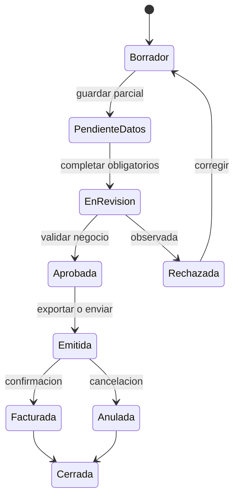
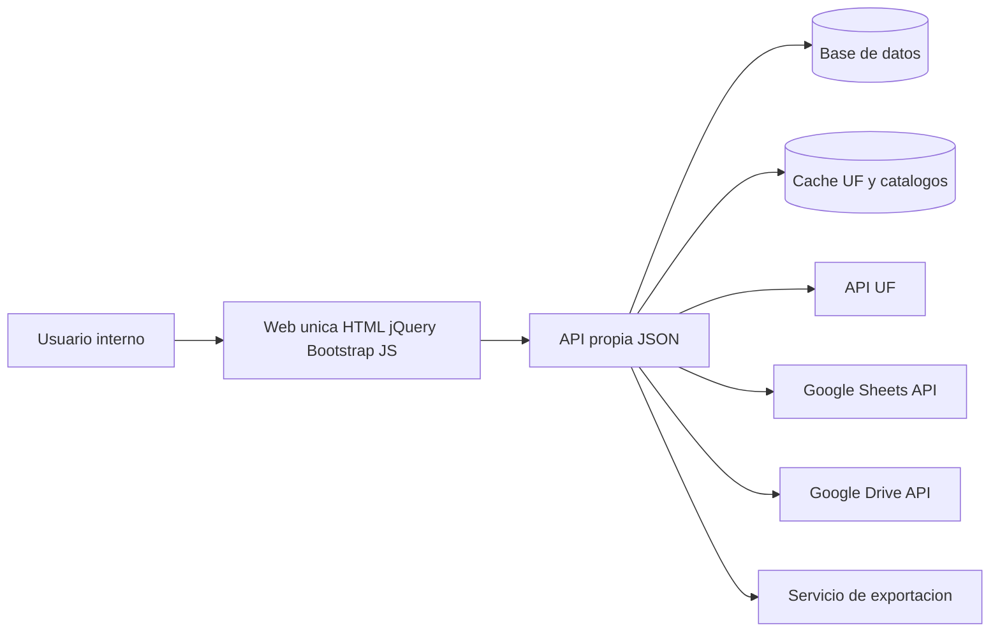
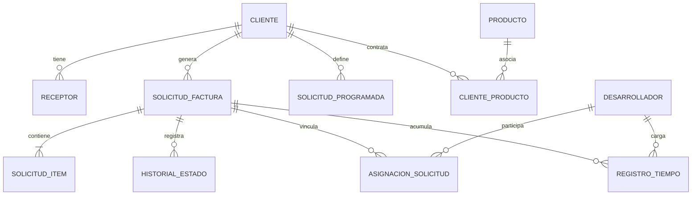

# Propuesta técnica y funcional para una web única de solicitudes de facturación

## Resumen ejecutivo

La mejor reformulación para este proyecto es una **aplicación web única** servida como un solo front-end en HTML + jQuery + Bootstrap + JS, organizada como **SPA ligera** con navegación interna por hash o vistas dinámicas, en lugar de una multipágina clásica. Ese enfoque encaja mejor con formularios extensos, filtros, historial, paneles de reportes y cambios de estado sin recargar página. Además, Bootstrap ya cubre formularios, tablas y navegación, mientras que jQuery permite consumir JSON y manejar flujos asíncronos con `$.getJSON()`, `$.ajax()` y callbacks `done/fail/always`. citeturn5view0turn5view1turn5view2turn5view3turn5view4

Para la integración de UF en entity["country","Chile","south american country"], la opción más directa es apoyarse en entity["organization","mindicador.cl","economic indicators api"]. Su API publica JSON para indicadores diarios, por tipo, por fecha específica (`{dd-mm-yyyy}`) y por año, e incluso documenta ejemplos de consumo desde `fetch` y jQuery. Aun así, para un entorno real conviene **encapsular esa llamada** detrás de un endpoint propio `/api/uf` para cachear por fecha, registrar errores y desacoplar el front-end de cambios externos. citeturn3view0turn4view0turn4view2

Aunque el requerimiento visible sea “una sola web”, el alcance funcional pedido **no debería resolverse como una web 100% estática**. En la práctica se necesita un **backend mínimo no especificado** —tipo BFF/API— para persistir clientes, solicitudes, estados, tiempos y reportes; proteger credenciales; integrar Google Sheets/Drive; y exportar documentos. La API de Google Sheets es REST y permite leer/escribir valores; Google Drive permite buscar archivos y exportar documentos de Workspace; y el patrón oficial para acceso servidor-a-servidor usa **service accounts** con credenciales JSON y tokens de acceso. Eso vuelve razonable proponer un backend liviano aunque el stack no haya sido definido. citeturn3view1turn6view1turn3view2turn6view2turn3view3turn8view0

La propuesta funcional debe centrarse en una entidad troncal llamada **Solicitud de Factura**, con dos modos operativos: **recurrente mensual** y **adicional**. Sobre esa base se construyen módulos de administración de clientes, asignación a desarrolladores, registro de tiempo, historial de estados, reportes por cliente y seguimiento de gasto acumulado por período y producto. Para cumplir el criterio “idéntica a la fuente”, la recomendación no es desarrollar todavía, sino definir una **homologación por plantilla**: mismos campos, mismo orden, mismas secciones, mismas sumatorias y misma salida exportable que el documento actual de referencia.

## Supuestos y criterios de alcance

Dado que en esta conversación no se adjuntaron plantillas finales, capturas ni archivos fuente con el documento exacto, la propuesta toma como fuente principal el **contexto funcional textual** ya entregado y lo convierte en una especificación ordenada. En consecuencia, “idéntica a la mostrada en las fuentes” debe interpretarse como **idéntica en estructura, campos, operación y exportación** respecto del documento base que el negocio valide en la etapa de diseño.

El alcance queda mejor definido con estos supuestos operativos:

| Tema | Supuesto de trabajo | Impacto en la propuesta |
|---|---|---|
| Front-end | Debe existir una sola aplicación web visible al usuario | Se recomienda una SPA ligera con un único `index.html` y vistas dinámicas |
| Backend | No especificado | Se propone un backend mínimo, desacoplado del front, solo para API, persistencia, integraciones y exportación |
| Autenticación | No especificada | La base asume acceso interno sin restricción obligatoria; se recomienda dejar preparada autorización por roles |
| Fuente exacta de la solicitud | No adjunta en esta conversación | Se propone homologación por plantilla/versionado, no desarrollo inmediato |
| Integraciones | Deben consumir JSON | Todas las integraciones se exponen al front como endpoints JSON propios |
| Solicitudes mensuales | Existen solicitudes fijas | Se modelan como plantillas recurrentes que generan instancias mensuales |
| Solicitudes adicionales | Existen como excepción al flujo fijo | Se modelan con asignación a desarrolladores y registro de tiempo |
| Reportabilidad | Debe existir panel por cliente | Los reportes se calculan sobre solicitudes, items, tiempos y productos asociados |

También conviene preservar compatibilidad conceptual con el proyecto anterior, porque aporta reglas valiosas que seguramente siguen siendo relevantes: cálculo en UF, equivalencia a CLP según fecha, referencias como OC/HES, posibilidad de productos o centros asociados, receptores/contacts y exportación exacta. La reformulación recomendada **no desecha ese legado**, sino que lo reordena dentro de un modelo más claro y mantenible.

El criterio de fidelidad de la solicitud debería aprobarse con una matriz simple:

| Criterio de fidelidad | Qué debe respetarse |
|---|---|
| Secciones | Mismo orden visual y lógico del documento actual |
| Campos | Mismos campos obligatorios/optativos y mismas etiquetas |
| Cálculos | Mismas reglas de subtotal, total, UF, CLP, IVA y redondeos cuando aplique |
| Detalle | Misma representación de productos, ítems, CP/MS u otros conceptos del negocio |
| Salida | Misma plantilla de exportación y misma lectura operativa para negocio |
| Auditoría | Cada exportación debe quedar asociada a una versión de plantilla |

## Propuesta funcional

La propuesta funcional debe cubrir una operación completa de facturación interna, desde la preparación de la solicitud hasta su consulta histórica, trazabilidad por estado y análisis por cliente. La entidad principal no debe ser el cliente ni el producto, sino la **solicitud**, porque sobre ella confluyen montos, fechas, estados, adjuntos, desarrolladores, trabajo cargado y reportes.

### Alcance funcional recomendado

La solución debe permitir:

- **Crear solicitudes de factura** con una estructura fiel al documento de referencia, incluyendo cliente, período, glosa, ítems, productos asociados, monto en UF o CLP, receptores, observaciones y adjuntos.
- **Administrar clientes** con ficha maestra, productos contratados, contactos/receptores, parámetros de facturación y estado comercial.
- **Consultar solicitudes anteriores** con filtros por cliente, estado, período, tipo, producto y responsable.
- **Gestionar estados** con historial y observaciones por cambio.
- **Mantener solicitudes fijas mensuales** mediante plantillas recurrentes que generen instancias periódicas.
- **Registrar solicitudes adicionales** fuera del flujo mensual.
- **Vincular solicitudes a desarrolladores** cuando una solicitud adicional implique trabajo técnico trazable.
- **Permitir que cada desarrollador vea el tiempo trabajado** en sus solicitudes adicionales, con vista personal y consolidado por solicitud.
- **Exponer paneles de reportes por cliente**, con gasto acumulado por período, desglose por producto, recurrente versus adicional, y carga asociada a horas de desarrollo.
- **Conservar trazabilidad documental**, de modo que cada solicitud exportada o emitida quede versionada y sea reabierta o duplicada sin perder historial.

### Estados propuestos

Un flujo razonable y suficientemente controlado para la solicitud es el siguiente:



Ese flujo resuelve lo esencial sin sobrediseñar. Además, permite imponer reglas claras: una solicitud **Borrador** es editable; en **En Revisión** puede bloquear ciertos campos; en **Emitida** ya no debería alterar montos; y en **Facturada** solo admite notas, no cambios estructurales.

### Entidades y atributos principales

| Entidad | Finalidad | Atributos principales |
|---|---|---|
| Cliente | Maestro comercial y tributario | `id`, `rut`, `razon_social`, `nombre_corto`, `estado`, `direccion`, `contactos`, `notas_facturacion` |
| Receptor | Destinatarios de la solicitud/factura | `id`, `cliente_id`, `nombre`, `email`, `cargo`, `activo` |
| Producto | Catálogo de servicios o productos asociados | `id`, `codigo`, `nombre`, `categoria`, `activo` |
| ClienteProducto | Relación cliente–producto | `id`, `cliente_id`, `producto_id`, `vigencia_desde`, `vigencia_hasta`, `condiciones` |
| SolicitudFactura | Núcleo del sistema | `id`, `folio`, `tipo`, `periodo`, `cliente_id`, `estado`, `fecha_solicitud`, `fecha_facturacion`, `uf_fecha`, `uf_valor`, `totales`, `glosa` |
| SolicitudItem | Detalle de la solicitud | `id`, `solicitud_id`, `producto_id`, `codigo_ref`, `descripcion`, `cantidad`, `uf_unitaria`, `clp_unitario`, `subtotal` |
| SolicitudProgramada | Plantilla recurrente mensual | `id`, `cliente_id`, `nombre`, `dia_emision`, `regla_periodo`, `activa`, `payload_base` |
| Desarrollador | Participante técnico | `id`, `nombre`, `email`, `equipo`, `activo` |
| AsignacionSolicitud | Vinculación solicitud–desarrollador | `id`, `solicitud_id`, `desarrollador_id`, `rol`, `horas_estimadas`, `activo` |
| RegistroTiempo | Tiempo trabajado en solicitudes adicionales | `id`, `solicitud_id`, `desarrollador_id`, `fecha`, `minutos`, `descripcion`, `aprobado` |
| HistorialEstado | Trazabilidad de cambios | `id`, `solicitud_id`, `estado`, `fecha`, `usuario`, `comentario` |
| DocumentoExportado | Evidencia de salida | `id`, `solicitud_id`, `tipo`, `formato`, `version_plantilla`, `ruta`, `checksum` |

### Mejoras razonables que conviene incorporar

Además de los requisitos explícitos, hay mejoras de alto valor y bajo riesgo conceptual que deberían entrar en la propuesta:

- **Duplicar solicitud anterior** para reducir digitación en clientes recurrentes.
- **Versionado de plantilla** para evitar que una exportación vieja cambie si el formato nuevo se modifica después.
- **Bloqueo por estado** para impedir ediciones impropias en solicitudes ya emitidas o facturadas.
- **Alertas de datos incompletos** antes de exportar, especialmente cliente, receptores, monto, UF o producto.
- **Historial de observaciones** por solicitud, visible para facturación y desarrollo.
- **Filtros guardados** por usuario interno, por ejemplo “mis solicitudes pendientes”.
- **Comparativo recurrente versus adicional** dentro del reporte de cliente.
- **Indicadores de desviación** entre horas estimadas y horas reales en solicitudes adicionales.
- **Bitácora de integración** para auditar cuándo falló UF o cuándo no se pudo leer Google Sheets.
- **Reapertura controlada** de solicitudes cerradas mediante evento explícito, no edición libre.

## Arquitectura técnica de la solución

La recomendación principal es una **SPA ligera**: un shell fijo, navegación lateral o superior, plantillas HTML parciales y capa de servicios jQuery para consumir JSON. Esto se ajusta mejor a una única web operativa que cambia entre dashboard, solicitud, clientes, desarrolladores y reportes sin recargar contexto. Bootstrap ofrece la base para formularios, tablas y tabs; jQuery soporta las llamadas JSON asíncronas y permite encadenar manejo de éxito, error y finalización. citeturn5view0turn5view1turn5view2turn5view3turn5view4

### Elección entre SPA ligera y multipágina

| Criterio | SPA ligera recomendada | Multipágina clásica |
|---|---|---|
| Experiencia en formularios largos | Muy buena | Menos fluida |
| Historial y filtros | Mejor persistencia de contexto | Más recargas y pérdida de foco |
| Reportes operativos | Más natural dentro de la misma sesión | Requiere navegación entre páginas |
| Complejidad front-end | Moderada | Baja |
| Escalabilidad funcional | Alta para este caso | Media |
| Recomendación | **Sí** | Solo si el alcance se reduce mucho |

### Arquitectura lógica recomendada



Aunque el front sea una sola web, la arquitectura debería separar claramente **presentación**, **API propia**, **persistencia**, **cache** e **integraciones externas**. En particular, Google Sheets admite lectura y escritura de valores mediante `spreadsheets.values.get`, `batchGet`, `update`, `batchUpdate` y `append`, y recomienda combinar operaciones por lotes para mejorar eficiencia. Además, la API de Sheets tiene cuotas por minuto y recomienda backoff exponencial ante `429` u otros errores temporales. citeturn6view1turn5view5turn3view5

### Backend mínimo propuesto

Como el backend no fue especificado, la propuesta debería dejarlo explícito como **“no especificado”** y sugerir tres caminos mínimos:

| Opción | Cuándo conviene | Ventaja principal | Riesgo principal |
|---|---|---|---|
| Node.js + Express | Equipo con dominio JS | Misma familia tecnológica que el front | Orden y mantenibilidad si no se modulariza bien |
| Python + FastAPI | Equipo mixto o fuerte en scripting | Muy ágil para API, validaciones y exportación | Requiere disciplina de despliegue |
| PHP + framework liviano | Hosting tradicional | Fácil adopción en servidores compartidos | Menor homogeneidad con el front |

La decisión correcta aquí no es “qué framework es mejor”, sino **qué backend cumple el rol mínimo**: persistir, autenticar si hace falta, proxyar integraciones, cachear UF y exportar documentos. Una solución puramente estática solo sería válida para un prototipo con datos públicos, sin seguridad ni trazabilidad real.

### Estructura de archivos del front-end

La aplicación puede seguir siendo “una sola web” aunque internamente esté organizada en varios archivos pequeños. La estructura sugerida es:

```text
/
├─ index.html
├─ assets/
│  ├─ css/
│  │  └─ app.css
│  ├─ js/
│  │  ├─ app.js
│  │  ├─ router.js
│  │  ├─ api.js
│  │  ├─ store.js
│  │  ├─ config.js
│  │  ├─ services/
│  │  │  ├─ clientes.service.js
│  │  │  ├─ solicitudes.service.js
│  │  │  ├─ reportes.service.js
│  │  │  ├─ tiempos.service.js
│  │  │  └─ integraciones.service.js
│  │  ├─ views/
│  │  │  ├─ dashboard.view.js
│  │  │  ├─ solicitudes.view.js
│  │  │  ├─ clientes.view.js
│  │  │  ├─ desarrolladores.view.js
│  │  │  └─ reportes.view.js
│  │  └─ utils/
│  │     ├─ format.js
│  │     ├─ validators.js
│  │     └─ ui.js
│  └─ templates/
│     ├─ dashboard.html
│     ├─ solicitud-form.html
│     ├─ solicitud-list.html
│     ├─ clientes.html
│     ├─ desarrolladores.html
│     └─ reportes.html
```

Si la restricción operativa exigiera **un único archivo físico**, entonces las plantillas podrían ir embebidas dentro de `index.html` en bloques `script type="text/template"`, pero esa variante solo la recomendaría si la plataforma de despliegue de verdad no admite publicar varios archivos estáticos.

## Modelo de datos y contratos API

La API propia debería exponer contratos JSON simples, consistentes y predecibles. jQuery interpreta respuestas JSON y las deja disponibles como objetos en el flujo `jqXHR`, por lo que conviene usar un envelope uniforme y no respuestas heterogéneas por módulo. citeturn5view0turn5view1

### Envelope JSON recomendado

```json
{
  "ok": true,
  "data": {},
  "meta": {
    "requestId": "req_20260503_001",
    "cached": false,
    "generatedAt": "2026-05-03T19:00:00-04:00"
  },
  "error": null
}
```

Y para errores:

```json
{
  "ok": false,
  "data": null,
  "meta": {
    "requestId": "req_20260503_002"
  },
  "error": {
    "code": "UF_UNAVAILABLE",
    "message": "No fue posible obtener el valor de la UF para la fecha solicitada.",
    "details": {
      "fecha": "2026-05-03",
      "source": "uf"
    }
  }
}
```

### Modelo JSON esperado para crear una solicitud

```json
{
  "tipo": "adicional",
  "cliente_id": "CLI-00045",
  "periodo": "2026-05",
  "fecha_solicitud": "2026-05-03",
  "fecha_facturacion": "2026-05-31",
  "estado": "borrador",
  "glosa": "Desarrollo evolutivo y soporte del periodo",
  "moneda_base": "UF",
  "uf_fecha": "2026-05-03",
  "receptores": [
    { "receptor_id": "REC-01" }
  ],
  "productos": [
    { "producto_id": "PROD-LMS" }
  ],
  "items": [
    {
      "tipo_item": "producto",
      "producto_id": "PROD-LMS",
      "codigo_ref": "MS25078",
      "descripcion": "Horas de desarrollo",
      "cantidad": 1,
      "uf_unitaria": 140
    }
  ],
  "desarrolladores": [
    {
      "desarrollador_id": "DEV-03",
      "rol": "implementacion",
      "horas_estimadas": 18
    }
  ],
  "referencias": {
    "oc": "OC-2026-019",
    "hes": "HES-8891"
  },
  "observaciones": "Solicitud adicional aprobada por cliente"
}
```

### Endpoints API necesarios

La integración de catálogos en hojas de cálculo debería apoyarse internamente en Google Sheets con operaciones `get`, `batchGet`, `update`, `batchUpdate` o `append`, según el dataset; las búsquedas y exportaciones de plantillas en Drive deberían resolverse con `files.list`, `files.get` o `files.export`, según si el archivo es binario o un documento nativo de Workspace. citeturn6view0turn6view1turn3view2turn3view4turn6view2turn7view0

| Método | Endpoint propuesto | Finalidad |
|---|---|---|
| GET | `/api/clientes` | Listar clientes con filtros |
| POST | `/api/clientes` | Crear cliente |
| GET | `/api/clientes/{id}` | Ver ficha de cliente |
| PATCH | `/api/clientes/{id}` | Editar cliente |
| DELETE | `/api/clientes/{id}` | Desactivar cliente |
| GET | `/api/clientes/{id}/productos` | Ver productos asociados |
| PUT | `/api/clientes/{id}/productos` | Actualizar productos asociados |
| GET | `/api/receptores?clienteId=` | Listar receptores por cliente |
| POST | `/api/receptores` | Crear receptor |
| PATCH | `/api/receptores/{id}` | Editar receptor |
| GET | `/api/productos` | Catálogo de productos |
| GET | `/api/desarrolladores` | Listado de desarrolladores |
| POST | `/api/desarrolladores` | Alta de desarrollador |
| PATCH | `/api/desarrolladores/{id}` | Mantención de desarrollador |
| GET | `/api/solicitudes` | Historial de solicitudes |
| POST | `/api/solicitudes` | Crear solicitud |
| GET | `/api/solicitudes/{id}` | Ver detalle |
| PATCH | `/api/solicitudes/{id}` | Editar borrador o solicitud permitida |
| POST | `/api/solicitudes/{id}/estado` | Cambiar estado |
| POST | `/api/solicitudes/{id}/duplicar` | Duplicar solicitud |
| GET | `/api/solicitudes/{id}/historial` | Ver historial de estados y eventos |
| POST | `/api/solicitudes/{id}/asignaciones` | Asignar desarrolladores |
| DELETE | `/api/solicitudes/{id}/asignaciones/{asigId}` | Quitar asignación |
| GET | `/api/solicitudes/{id}/tiempos` | Ver tiempos cargados |
| POST | `/api/solicitudes/{id}/tiempos` | Registrar tiempo |
| PATCH | `/api/tiempos/{id}` | Corregir tiempo |
| GET | `/api/solicitudes-programadas` | Listar plantillas mensuales |
| POST | `/api/solicitudes-programadas` | Crear plantilla recurrente |
| PATCH | `/api/solicitudes-programadas/{id}` | Editar plantilla recurrente |
| POST | `/api/solicitudes-programadas/{id}/generar` | Generar instancia del período |
| GET | `/api/reportes/clientes` | Ranking y consolidado por cliente |
| GET | `/api/reportes/clientes/{id}` | Panel detallado de un cliente |
| GET | `/api/reportes/gastos` | Serie temporal de gastos |
| GET | `/api/reportes/desarrolladores/{id}` | Productividad y tiempos por desarrollador |
| GET | `/api/uf?fecha=YYYY-MM-DD` | Obtener UF cacheada y trazable |
| POST | `/api/integraciones/google-sheets/sync` | Sincronizar datasets desde hojas |
| GET | `/api/integraciones/google-sheets/catalogos?dataset=clientes` | Consultar catálogo materializado |
| POST | `/api/exportaciones/solicitud/{id}` | Exportar solicitud |
| GET | `/api/exportaciones/{id}` | Consultar resultado de exportación |

### Datos que conviene materializar desde Google Sheets

No todo debe consultarse en vivo cada vez. La propuesta funcional se beneficia si ciertos catálogos se **sincronizan** desde hojas hacia tablas propias:

| Dataset de origen | Uso operativo | Recomendación |
|---|---|---|
| Clientes | Maestro operativo | Sincronización programada + edición interna permitida |
| Receptores | Envío y validación | Sincronización programada |
| Productos | Asociación y reportes | Sincronización programada |
| CP/MS o equivalentes | Detalle de solicitud | Sincronización programada |
| Proyecciones | Dashboard comparativo | Solo lectura + snapshot por período |
| Plantillas documentales | Exportación | Versionado fuera del front |

## Diseño de interfaz y experiencia operativa

La interfaz debería dividirse en módulos visibles desde una sola navegación principal. Bootstrap cubre bien formularios, tablas y navegación tabulada, de modo que no hace falta sobredimensionar el front con un framework más pesado para este alcance. citeturn5view2turn5view3turn5view4

### Pantallas propuestas

| Pantalla | Campos o visualizaciones principales | Acciones clave |
|---|---|---|
| Dashboard | KPIs, pendientes por estado, solicitudes del período, alertas de integración | Abrir solicitud, ir a reportes, revisar errores |
| Solicitudes | Filtros por cliente, estado, período, tipo y producto; tabla histórica | Crear, editar, duplicar, cambiar estado, exportar |
| Nueva solicitud | Datos generales, cliente, receptores, productos, items, UF/CLP, glosa, referencias, desarrolladores | Guardar borrador, validar, enviar a revisión |
| Solicitudes recurrentes | Plantillas mensuales, calendario de generación, vigencias | Crear plantilla, activar/desactivar, generar período |
| Clientes | Ficha, productos asociados, receptores, condiciones de facturación, historial resumido | Crear, editar, asociar productos, ver gasto |
| Desarrolladores | Asignaciones activas, tiempos por solicitud, carga semanal/mensual | Registrar tiempo, corregir, filtrar adicionales |
| Reporte por cliente | Serie temporal de gasto, reparto por producto, recurrente vs adicional, horas dev asociadas | Filtrar período, exportar, abrir detalle |
| Configuración e integraciones | Estado de UF, última sincronización de Sheets, versión de plantilla | Re-sincronizar, invalidar cache, probar exportación |

### Wireframe ilustrativo de la shell principal

El siguiente snippet no es desarrollo funcional; sirve solo para fijar la composición visual esperada:

```html
<style>
  .app-shell{display:grid;grid-template-columns:260px 1fr;min-height:100vh}
  .sidebar{background:#f8f9fa;border-right:1px solid #dee2e6;padding:1rem}
  .content{padding:1.25rem}
  .page-title{display:flex;justify-content:space-between;align-items:center;margin-bottom:1rem}
  .kpi-grid{display:grid;grid-template-columns:repeat(4,1fr);gap:1rem}
  .card-kpi{border:1px solid #dee2e6;border-radius:.5rem;padding:1rem;background:#fff}
</style>

<div class="app-shell">
  <aside class="sidebar">
    <h5>Facturación</h5>
    <ul class="nav flex-column">
      <li class="nav-item"><a class="nav-link active" href="#/dashboard">Dashboard</a></li>
      <li class="nav-item"><a class="nav-link" href="#/solicitudes">Solicitudes</a></li>
      <li class="nav-item"><a class="nav-link" href="#/recurrentes">Mensuales</a></li>
      <li class="nav-item"><a class="nav-link" href="#/clientes">Clientes</a></li>
      <li class="nav-item"><a class="nav-link" href="#/desarrolladores">Desarrolladores</a></li>
      <li class="nav-item"><a class="nav-link" href="#/reportes">Reportes</a></li>
    </ul>
  </aside>

  <main class="content">
    <div class="page-title">
      <h2>Dashboard</h2>
      <button class="btn btn-primary">Nueva solicitud</button>
    </div>

    <section class="kpi-grid">
      <article class="card-kpi">
        <small>Solicitudes pendientes</small>
        <h3>12</h3>
      </article>
      <article class="card-kpi">
        <small>Emitidas este mes</small>
        <h3>28</h3>
      </article>
      <article class="card-kpi">
        <small>Adicionales activas</small>
        <h3>7</h3>
      </article>
      <article class="card-kpi">
        <small>Clientes con alertas</small>
        <h3>3</h3>
      </article>
    </section>
  </main>
</div>
```

### Wireframe ilustrativo de la pantalla de solicitud

```html
<div class="container-fluid">
  <div class="row g-3">
    <div class="col-lg-8">
      <div class="card">
        <div class="card-header">Solicitud de factura</div>
        <div class="card-body">
          <div class="row g-3">
            <div class="col-md-6">
              <label class="form-label">Cliente</label>
              <select class="form-select"></select>
            </div>
            <div class="col-md-3">
              <label class="form-label">Tipo</label>
              <select class="form-select">
                <option>Mensual</option>
                <option>Adicional</option>
              </select>
            </div>
            <div class="col-md-3">
              <label class="form-label">Estado</label>
              <input class="form-control" value="Borrador" disabled>
            </div>
            <div class="col-12">
              <label class="form-label">Glosa</label>
              <textarea class="form-control" rows="3"></textarea>
            </div>
          </div>

          <hr>

          <h6>Detalle</h6>
          <table class="table table-sm align-middle">
            <thead>
              <tr>
                <th>Producto</th>
                <th>Código</th>
                <th>Descripción</th>
                <th>Cant.</th>
                <th>UF</th>
                <th>Subtotal</th>
              </tr>
            </thead>
            <tbody>
              <tr>
                <td>LMS</td>
                <td>MS25078</td>
                <td>Horas de desarrollo</td>
                <td>1</td>
                <td>140</td>
                <td>140 UF</td>
              </tr>
            </tbody>
          </table>
        </div>
      </div>
    </div>

    <aside class="col-lg-4">
      <div class="card">
        <div class="card-header">Resumen</div>
        <div class="card-body">
          <p class="mb-1">UF fecha: <strong>2026-05-03</strong></p>
          <p class="mb-1">Valor UF: <strong>$39.000 aprox.</strong></p>
          <p class="mb-1">Subtotal: <strong>140 UF</strong></p>
          <p class="mb-1">Estado: <span class="badge text-bg-secondary">Borrador</span></p>
          <div class="d-grid gap-2 mt-3">
            <button class="btn btn-outline-secondary">Guardar borrador</button>
            <button class="btn btn-primary">Enviar a revisión</button>
            <button class="btn btn-success">Exportar</button>
          </div>
        </div>
      </div>
    </aside>
  </div>
</div>
```

### Relación entre entidades del dominio



## Integraciones, validaciones y operación

### Estrategia de integración con UF

La API UF propuesta debe quedar detrás de `/api/uf?fecha=YYYY-MM-DD`, aunque la fuente final siga siendo mindicador. La razón es funcional y operativa: el sitio publica consultas por indicador, por fecha y por año, y muestra ejemplos de consumo directo en browser; sin embargo, el proyecto exige trazabilidad, manejo de errores y eficiencia. Por eso el front no debería pegarle a la fuente externa como estrategia principal, sino a un proxy interno que registre la fecha consultada, retorne el valor usado en la solicitud y marque si vino de cache. citeturn4view0turn4view2turn3view0

La política de cache recomendada es esta:

| Caso UF | Política sugerida |
|---|---|
| Fecha histórica cerrada | Cache persistente por fecha, sin expiración automática |
| Fecha actual | Cache corta y revalidable |
| Error temporal del proveedor | Intentar reintento controlado; si existe cache válida, avisar y reutilizar |
| Exportación | Persistir en la solicitud el `uf_valor` efectivamente usado |
| Auditoría | Guardar `fecha`, `valor`, `source`, `cached`, `requestId` |

### Estrategia de integración con Google Sheets y Google Drive

La API de Google Sheets es REST, trabaja con objetos `spreadsheetId`, rangos en notación A1 y operaciones de lectura/escritura por rango o por lote. Google además documenta que el `spreadsheetId` es estable aunque cambie el nombre del archivo, lo cual hace recomendable almacenar IDs y rangos, no títulos visibles, dentro de la configuración del sistema. citeturn3view1turn6view0turn6view1

Para datasets privados o corporativos, la alternativa correcta no es exponer credenciales en jQuery. Google diferencia entre **API keys** para datos públicos, **OAuth client IDs** para apps que acceden a datos del usuario final y **service accounts** para aplicaciones que acceden a sus propios recursos o actúan con delegación. Además, la creación de la service account implica credenciales JSON con llave privada, que deben almacenarse de forma segura. Por eso la integración con Sheets/Drive debe vivir **en el backend**, no en el navegador. citeturn8view0turn3view3

La estrategia operativa recomendada es:

| Integración | Estrategia |
|---|---|
| Clientes / receptores / productos | Lectura desde Sheets por `batchGet`, luego materialización en tablas propias |
| Escrituras a origen | Solo si el negocio exige que Sheets siga siendo maestro; si no, sincronización unidireccional |
| Plantillas documentales en Drive | Buscar por `files.list`, descargar binarios con `files.get` o exportar documentos Workspace con `files.export` |
| Plantillas Google Sheets | Exportación a `.xlsx` cuando el proceso documental lo requiera |
| Errores 429 / 5xx | Reintentos con backoff exponencial |
| Trazabilidad | Guardar fecha de última sync, dataset, número de registros y errores |

Google Drive permite buscar archivos con `files.list`, y exportar documentos nativos de Workspace con `files.export`; para hojas de cálculo, ese export soporta `.xlsx`. Si la plantilla vive como archivo binario ya cargado en Drive, entonces corresponde `files.get` con descarga; si vive como hoja/documento nativo, corresponde exportación. citeturn3view2turn3view4turn6view2turn7view0

### Cuotas y tolerancia a fallos

Google Sheets aplica cuotas por minuto y recomienda **truncated exponential backoff** para errores temporales. La lectura y escritura cuentan por separado; los batch requests ayudan a agrupar operaciones; y toda solicitud de actualización es atómica. Esa información importa directamente al diseño: conviene reducir round-trips, sincronizar catálogos en lote, y nunca disparar lecturas individuales por fila desde el front. citeturn5view5turn3view5

### Validaciones funcionales recomendadas

| Área | Validación |
|---|---|
| Cliente | Debe existir, estar activo y tener al menos un receptor válido si la solicitud será emitida |
| Solicitud | Debe tener tipo, período, fecha y glosa mínima |
| Ítems | No permitir líneas vacías ni subtotales nulos |
| Moneda/UF | Si la solicitud usa UF, debe existir `uf_fecha` y `uf_valor` trazable |
| Productos | Cada ítem debería asociarse a un producto o categoría reportable |
| Recurrente | Debe tener regla de generación, vigencia y payload base |
| Adicional | Debe poder asociarse a uno o más desarrolladores |
| Tiempo | Minutos positivos, fecha válida y desarrollador asignado |
| Estados | No permitir pasar a Emitida si faltan datos obligatorios |
| Exportación | Bloquear export si la plantilla requerida no está disponible o validada |

### Manejo de errores

La web debería mostrar errores como parte de la experiencia operativa, no como mensajes genéricos. Lo recomendable es tipificar:

| Código | Significado | Acción UI |
|---|---|---|
| `UF_UNAVAILABLE` | No se obtuvo UF | Mostrar alerta y reintento |
| `SHEETS_SYNC_FAILED` | Falló sync de catálogo | Mantener último snapshot y avisar |
| `VALIDATION_ERROR` | Faltan campos o reglas | Resaltar secciones/inputs |
| `EXPORT_TEMPLATE_MISSING` | No existe plantilla | Bloquear exportación |
| `STATE_TRANSITION_INVALID` | Cambio de estado inválido | Mostrar explicación del flujo |
| `TIME_ENTRY_FORBIDDEN` | Tiempo sobre solicitud no permitida | Restringir acción y registrar evento |

### Autenticación y autorización

Como la autenticación no fue especificada, el supuesto base puede ser **uso interno controlado fuera de la aplicación**. Aun así, por la sensibilidad de la información financiera, la propuesta debería dejar preparado un esquema de autorización simple:

| Perfil | Acceso sugerido |
|---|---|
| Administrador | Todo |
| Facturación/Operaciones | Clientes, solicitudes, reportes, exportación |
| Desarrollador | Ver solicitudes adicionales asignadas y registrar/consultar su tiempo |
| Consulta | Solo lectura de reportes y seguimiento |

No hace falta convertir esto en una condición de entrada del proyecto, pero sí dejarlo explícito como recomendación de productivización.

## Plan por fases y entregables

La estimación razonable es plantear tres fases. No es una estimación de desarrollo detallado por tarea, sino una proyección de esfuerzo para convertir esta propuesta en una solución ejecutable. La duración final variará según cantidad de plantillas, complejidad del export, calidad de los datos en Sheets y validación del documento “idéntico”.

### Estimación de esfuerzo

| Fase | Objetivo | Esfuerzo estimado | Resultado esperado |
|---|---|---|---|
| Fase de definición y base funcional | Modelo funcional, UX, entidades, APIs y navegación principal | 2 a 3 semanas | Especificación detallada aprobada + prototipo navegable no funcional |
| Fase de núcleo operativo | Clientes, solicitudes, estados, recurrencia, desarrolladores, tiempos | 3 a 5 semanas | Núcleo del sistema operando con API propia |
| Fase de integraciones y cierre | UF, Google Sheets/Drive, exportación, reportes, hardening | 3 a 4 semanas | Integraciones activas, reportes y salida documental homologada |

### Entregables por fase

| Fase | Entregables |
|---|---|
| Fase de definición y base funcional | Documento funcional final, mapa de pantallas, wireframes, contrato API, modelo de datos, flujo de estados, criterios de homologación de plantilla |
| Fase de núcleo operativo | Web única operativa con módulos base, CRUD de clientes, CRUD de solicitudes, historial, estados, recurrencia y tiempos de desarrolladores |
| Fase de integraciones y cierre | Proxy UF, proxy Google Sheets/Drive, exportación documentada, reportes por cliente, dashboard, validaciones finales, manual operativo y checklist de despliegue |

### Recomendación de cierre ejecutivo

La decisión de diseño más importante en esta propuesta es doble: **mantener una sola web en el front** y, al mismo tiempo, **no forzar una arquitectura 100% estática** para un problema que requiere persistencia, seguridad de credenciales, historial, integraciones y exportación. Con ese criterio, la propuesta queda alineada con el mandato de simplicidad tecnológica del usuario, pero evita una falsa simplificación que después rompería en producción. La solución más sólida es, por tanto, una **SPA ligera en HTML + jQuery + Bootstrap + JS**, respaldada por una **API propia mínima** que centralice UF, Google Sheets/Drive, estados, trazabilidad y exportación documental.