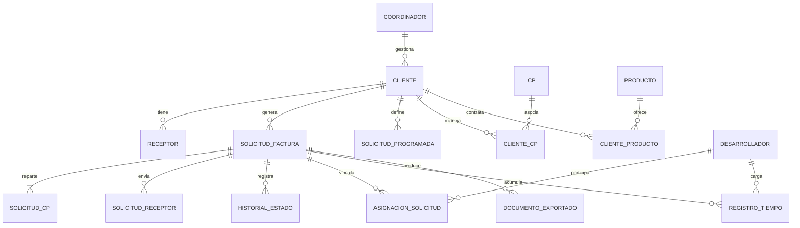

# Modelo de dominio

## Glosario operativo

| Término | Definición |
|---|---|
| **Solicitud de Factura** | Documento interno que pide al área de Administración (Macarena Ayala) emitir una factura al cliente. Es el núcleo del sistema. |
| **Grupo MAS** | Conglomerado emisor: **MAS Consultores S.A.** (afecto IVA) y **Más Capacitación** (SENCE / exento). |
| **Facturar Por** | Selector entre las dos empresas del Grupo MAS. Define afecto/exento. |
| **OC** (Orden de Compra) | Documento del cliente que autoriza el gasto. Requerido para facturar (salvo cuando hay contrato anual). |
| **HES** (Hoja de Entrada de Servicio) | Comprobante de recepción conforme. Algunos clientes (ej. Transelect) lo exigen para facturar. |
| **Glosa** | Texto descriptivo de qué se está cobrando (mes, hito, servicio). |
| **Receptor** | Persona del cliente que recibe el documento (nombre + email). Una solicitud puede tener varios. |
| **CP** (Centro de Proyecto) | Identificador interno del proyecto al que se imputa el ingreso (p.ej. `MS25008`). Una solicitud puede repartirse en varios CP, cada uno con monto. |
| **UF** | Unidad de Fomento. Las propuestas se cotizan en UF; se factura en CLP al valor del día de facturación. |
| **Coordinador** | Persona responsable del cliente. Hace seguimiento desde el día 15 del mes y solicita la facturación. Tiene ID Slack. |
| **Solicitud Recurrente Mensual** | Plantilla que genera automáticamente la solicitud de cada período según `frecuencia` y `dia_facturacion`. |
| **Solicitud Adicional** | Solicitud fuera del flujo recurrente, típicamente asociada a desarrollo extra. Permite asignar desarrolladores y registrar tiempo. |
| **Proyecciones** | Excel histórico que centralizaba ventas, hitos y caja por CP. La app debe alimentarlo o reemplazarlo (vía sync Google Sheets en Fase 2). |
| **Estado verde** | En Proyecciones, marca de "facturado". Equivale a estado `Facturada` o `Cerrada` en el sistema. |

## Entidades principales

Detalle de cada tabla en [`modelo-datos.md`](modelo-datos.md).

## Reglas de negocio extraídas de los archivos fuente

1. La empresa emisora se elige al crear la solicitud:
   - **MAS Consultores S.A.** → afecto IVA (19%).
   - **Más Capacitación** → exento.
   - **Mixto** → cuando una solicitud reparte entre ambas (poco común; MVP puede pedir crear dos solicitudes separadas).
2. Para emitir hace falta al menos uno de:
   - Número de OC, **o**
   - Número de Contrato anual.
3. Algunos clientes exigen HES (caso conocido: Transelect).
4. La glosa debe especificar mes / hito / servicio.
5. Si la solicitud está en UF, debe registrar `uf_fecha` y el `uf_valor` usado al momento del cierre.
6. Un cliente tiene una **frecuencia** (Mensual / Bimensual / Trimestral / Anual / Adicional) y un **día de facturación**.
7. El coordinador del cliente es responsable de gestionar la solicitud desde el día 15 del mes anterior al cierre.
8. Cada solicitud puede tener múltiples **CP** con montos parciales que suman al neto.
9. Una solicitud emitida no debe alterar montos; en estado `Facturada` solo admite notas.
10. Toda exportación queda asociada a una versión de plantilla (`version_plantilla`).
