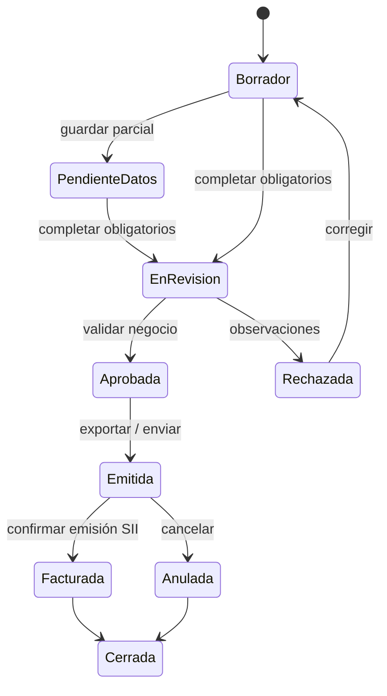

# Máquina de estados — Solicitud de Factura

## Reglas por estado

| Estado | Editable | Acciones permitidas | Requisitos para salir |
|---|---|---|---|
| `Borrador` | Todo | Guardar, completar, descartar | Cliente, glosa, al menos 1 ítem o CP, monto > 0 |
| `PendienteDatos` | Todo | Completar campos faltantes | Cliente, receptores, montos, OC o contrato |
| `EnRevision` | Solo notas / observaciones | Aprobar / Rechazar | Validación negocio |
| `Aprobada` | Solo notas | Exportar, enviar a Administración | Plantilla disponible |
| `Rechazada` | Sí (vuelve a Borrador) | Corregir | — |
| `Emitida` | No (solo notas y receptores adicionales) | Marcar facturada / Anular | Confirmación SII |
| `Facturada` | No (solo notas) | Cerrar, ver histórico | — |
| `Anulada` | No | Cerrar | — |
| `Cerrada` | No | Solo lectura | — |

## Validaciones por transición

| De → A | Validaciones |
|---|---|
| `* → EnRevision` | Cliente activo, ≥ 1 receptor, glosa, monto > 0, (OC o contrato), si `cliente.requiere_hes` → HES presente |
| `EnRevision → Aprobada` | Validador es Coordinador o Admin. Comentario opcional. |
| `Aprobada → Emitida` | Plantilla `version_plantilla` disponible. Si `moneda_base = UF` → `uf_fecha` y `uf_valor` persistidos. |
| `Emitida → Facturada` | Folio fiscal o número de factura externo. Fecha de facturación. |
| `Emitida → Anulada` | Comentario obligatorio. |

## Auditoría

Cada transición escribe una fila en `historial_estado` con:
- `estado_desde`, `estado_hacia`
- `usuario` (email o ID)
- `comentario` (obligatorio para `Rechazada` y `Anulada`)
- `fecha` (default `now()`)

## Reapertura

- `Cerrada → Borrador` solo bajo evento explícito **"Reapertura controlada"**, registrado como entrada de historial con motivo. Solo perfil Admin.
